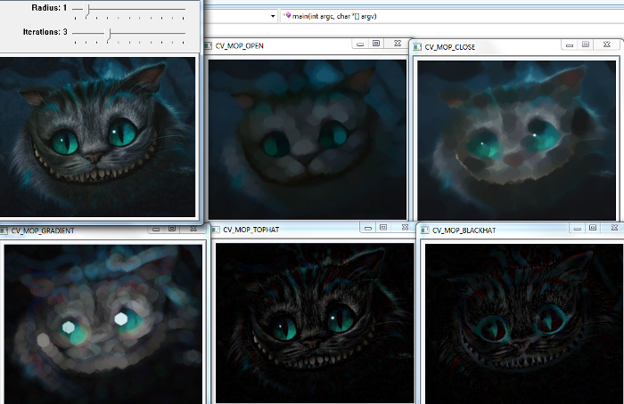

Нужно перед сборкой установить

libgtk2.0-dev
pkg-config

Mat img – тип данных изображения

imread – функция чтения изображения

cv2.IMREAD_UNCHANGED  or -1
cv2.IMREAD_GRAYSCALE  or 0
cv2.IMREAD_COLOR  or 1

Морфологические преобразования нужны для обработки изображения от шумов
Эрозия - увеличивает тёмные области, обычно используется для избавления от случайных вкраплений
Диляция - увеличивает светлые области

Комбинирование этих двух операторов создаёт операторы открытия и закрытия
ЭД ДЭ
Закрытие - сначала расширяется, а затем сужается. Обычно используется для уменьшения шумовых выбросов на границах регионов.
Градиент - Dilate(src)–Erode(src)
Результатом этой операции над двоичным изображением станет выделение периметров существующих пятен. На картинке с градациями серого градиент покажет как быстро меняется яркость (поэтому и называется — градиент).

Морфологические операции, чаще всего, применяются над двоичными изображениями, которые получаются после порогового преобразования (thresholding).

Наиболее часто оператор Собеля применяется в алгоритмах выделения границ.

Шаги детектора Кенни:
— Убрать шум и лишние детали из изображения
— Рассчитать градиент изображения
— Сделать края тонкими (edge thinning)
— Связать края в контура (edge linking)